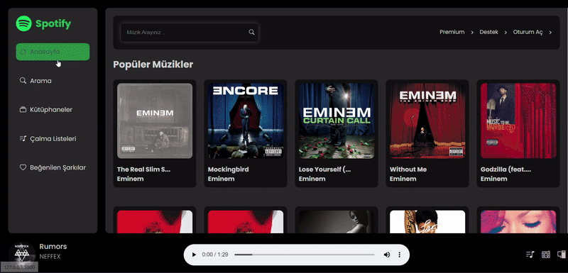

# Spotify-Clone

In this project, a music player application was built using HTML, SCSS and Javascript. Classic color scheme of Spotify extended with dynamic animations for a better experience. With the help of Shazam API, users can search for any music or artist and easily acces the songs as they wish. 

# Used API

https://rapidapi.com

# Preview

